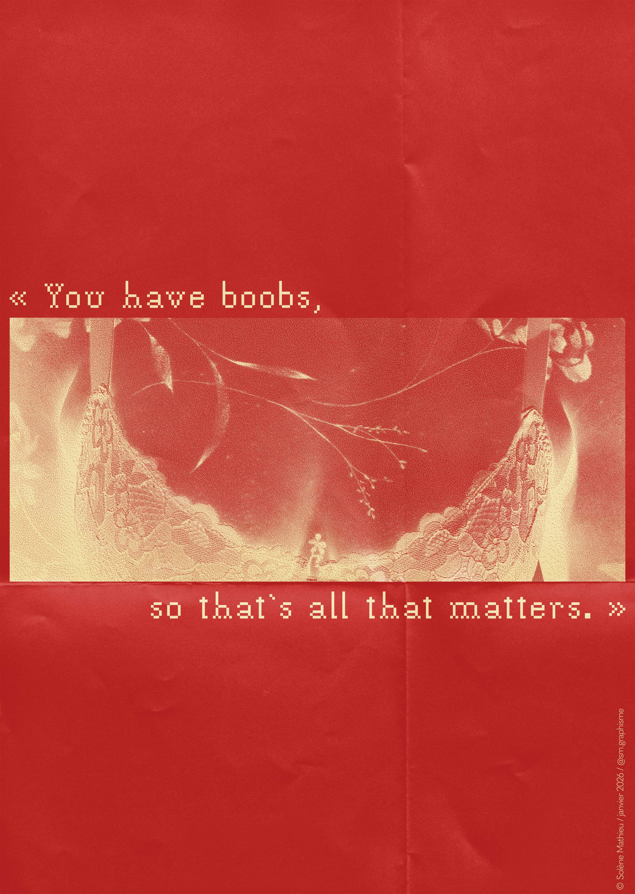
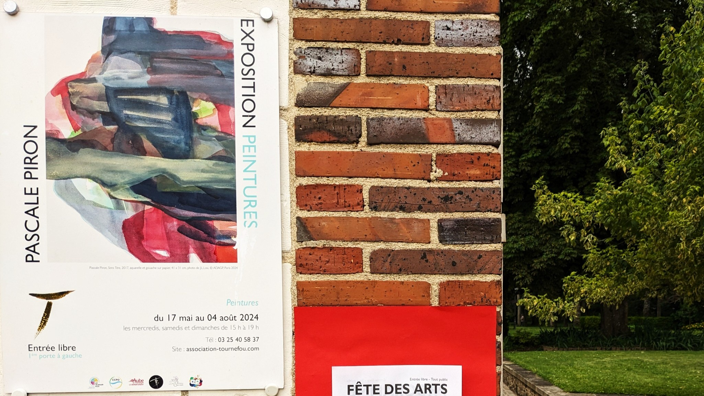

## **Aperçu de mes créations**

-   
    

    ---

     __Travaux manuels__

    Découpage et collage

-   

    ---

     __Affiches__

    Des expériences, des idées que j'exprime basées sur mes opinions et mon vécu.

-   

    ---

     __Ordinateur portable__

    Mettons en lumière les objets du quotidien.

-   
    

    ---

     __Association Tournefou__

    Réalisations des supports de communication pour le Tournefou, association artistique et culturelle.

---
## **Graphiste-maquettiste et photographe**
Je suis diplômée en tant qu'infographiste metteur en page et j'ai, à ce jour, 4 ans d'expériences en graphisme dans les secteurs de l'Art et de la Culture.
J'ai principalement travaillé sur la mise en page de documents longs (livrets, communiqués de presse...), mais également sur des affiches, des flyers, des cartons d'invitation...

Dans mes projets personnels, j'essaie de montrer autant de sujets que je peux grâce à mes trois passions : le graphisme, la photographie et la recherche.

J'exprime des expériences vécues (bonnes ou mauvaises), des idées, des choses intéressantes que je vois ou imagine, à travers mes créations.

*I have a degree in graphic design and currently have 4 years of experience in graphic design in the arts and culture sector. I have mainly worked on the design of long documents (booklets, press releases, etc.), but also on posters, flyers, invitations, etc.*

*In my personal projects, I try to explore as many subjects as I can through my three passions: graphic design, photography, and research.*

*I express my experiences (good and bad), ideas, and interesting things I see or imagine through my creations.*

---
## **Distinctions**
Photos sélectionnées pour les albums **Wipplay** :

*Photos selected for* ***Wipplay*** *albums:*

- *Images Sensorielles* (présélection du jury)
- *Nuage(s)* (+ exposition)
- *Culture Agricole*

Expositions :

*Exhibitions:*

- *Postcard Size*, Galerie Openbach, France, du 2 au 30 avril 2026
- *Festival Paste Up Warsaw 2026* Paste Up Warsaw, Boulevard Vistula, Pologne, à partir du 30 mai 2026
  

---
## **Contact**
E-mail : contact@solenemathieu.fr